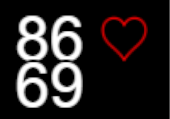
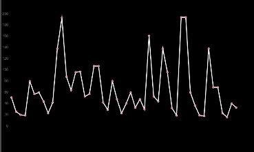
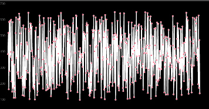
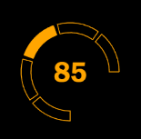

# What is the goal of this project?
Read your Heartbeat with an arduino.  
Display it to a webpage, so it can be included in OBS.

# What you need
## Hardware
| Name | Quantity |
| --- | --- |
Arduino | 1
Breadboard | 1
Connecting wires | 5
ECG sensor | 1

## Software
Python 3
# Setup 
## Hardware
For the Hardware part follow [this guide](https://how2electronics.com/ecg-monitoring-with-ad8232-ecg-sensor-arduino/).

The following image for the placement of the electrodes on the body is from a mirrored perspective. The red/yellow electrodes go to the right side of your body.  
  

## Installation
```bash
pip install -r requirements.txt
```
# Usage
## Start reading from Arduino and webpage
```console
BASH:
$ export FLASK_APP=app

CMD:
> set FLASK_APP=app

Powershell:
> $env:FLASK_APP = "app"

flask run
```
## Display page in OBS
In OBS add those URLs as a new Source -> Browser.

|url|description|preview|
|---|---|---|
http://localhost:5000/index.html | Top Row: Avgeraged BPM over the last 3 beats, Bottom Row: Exact BPM based on the last beat | 
http://localhost:5000/hist_bpm.html | Graph of last 50 BPM | 
http://localhost:5000/raw_data.html | Graph of last 500 sensor values | 
http://localhost:5000/animated.html | Animated Pulsemeter, colors depending on pulse | 

## Use OBS as cam
https://obsproject.com/forum/resources/obs-virtualcam.949/